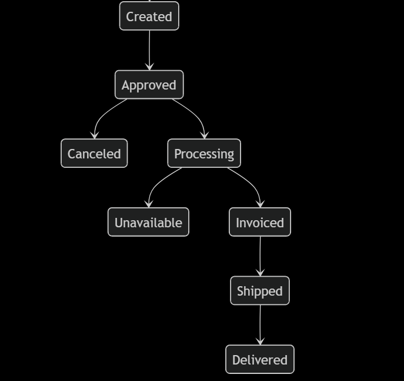
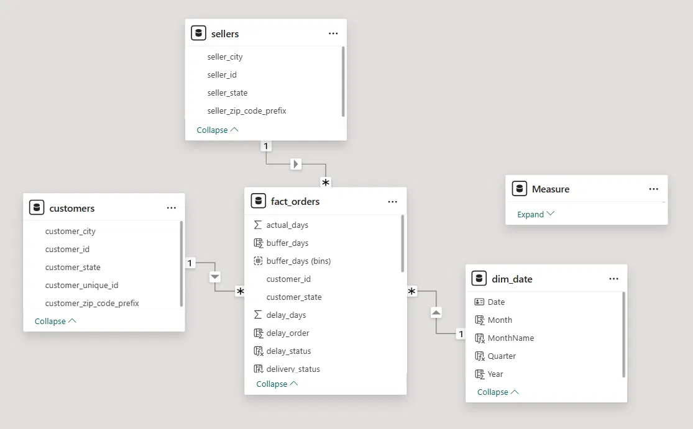
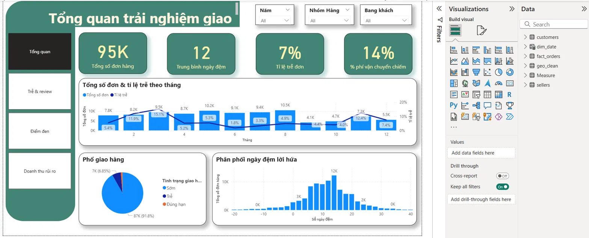
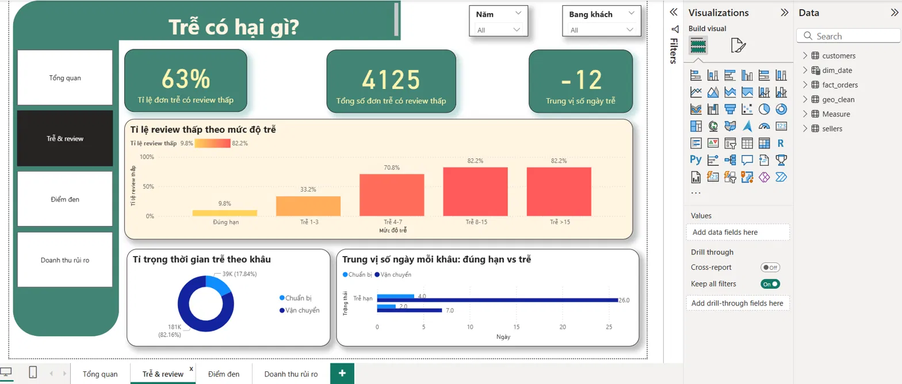
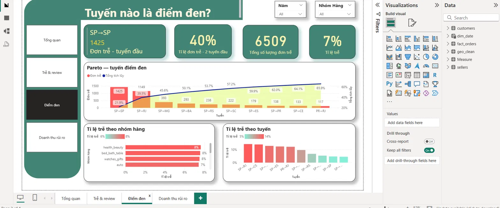
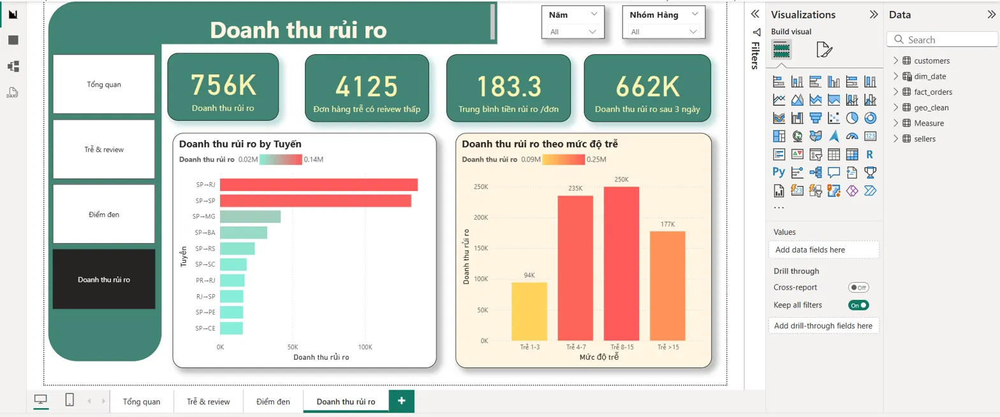
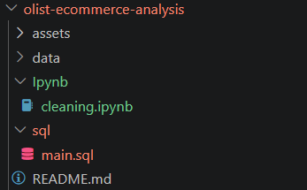

# Olist E-commerce — Dự án về trải nghiệm giao hàng thực sự tốt đến đâu?

Phân tích ~95.000 đơn hàng đã giao của sàn Olist (Brazil, 2016–2018) để trả lời một câu hỏi :
**"Trải nghiệm giao hàng thực sự tốt đến đâu, ai đang chịu thiệt, và chi phí ẩn nằm ở đâu?"**

**Công cụ:** SQL · Python · Power BI

📊 **[Xem dashboard](assets\olist_dashboard.pdf)** 

---

## 1. Bối cảnh & câu hỏi business

### Bối cảnh

Olist là sàn e-commerce kết nối seller nhỏ với các marketplace lớn tại Brazil. Với mô hình này, trải nghiệm giao hàng là thứ Olist *chịu trách nhiệm về uy tín* nhưng *không trực tiếp kiểm soát toàn bộ*  nên câu hỏi "giao hàng đang tốt hay tệ, và tệ ở đâu" có giá trị hành động thật.

### Câu hỏi business
| # | Câu hỏi |
|---|---|
| 1 | Lời hứa giao hàng có sát thực tế không? |
| 2 | Phí vận chuyển (freight) chiếm bao nhiêu % giá trị đơn? |
| 3 | Trễ ảnh hưởng review thế nào — điểm gãy ở đâu? |
| 4 | Trễ do khâu nào: seller chuẩn bị hàng hay carrier vận chuyển? |
| 5 | Tuyến giao hàng nào là điểm đen? |
| 6 | Bao nhiêu doanh thu đang mắc kẹt ở đơn vừa trễ vừa review thấp? |
| 7 | Ngưỡng hành động cụ thể nằm ở đâu? |

---

## 2. Dữ liệu & pipeline

**Nguồn:** [Brazilian E-Commerce Public Dataset by Olist (Kaggle)](https://www.kaggle.com/datasets/olistbr/brazilian-ecommerce) — 8 bảng, ~99K đơn hàng, 2016–2018.

### Vòng đời một đơn hàng và vì sao chỉ phân tích đơn `delivered`

Mỗi đơn Olist đi qua chuỗi trạng thái, mỗi mốc để lại một timestamp:

Nhánh chính: `created → approved → processing → invoiced → shipped → delivered`. Hai nhánh fail: `canceled` (hủy sau khi đặt/thanh toán) và `unavailable` .

Các timestamp này chính là nguyên liệu cho mọi metric trong dự án:

| Timestamp | Ý nghĩa business | Metric tính từ nó |
|---|---|---|
| `order_purchase_timestamp` | Khách đặt hàng | Mốc gốc; `promised_days = estimated − purchase` |
| `order_approved_at` | Thanh toán xác nhận — khâu seller bắt đầu | `seller_processing_days = carrier − approved` |
| `order_delivered_carrier_date` | Seller bàn giao carrier — khâu vận chuyển bắt đầu | `shipping_days = customer − carrier` |
| `order_delivered_customer_date` | Khách nhận hàng | `delay_days = customer − estimated` |
| `order_estimated_delivery_date` | ETA hứa với khách ngay lúc đặt | Chuẩn so sánh cho trễ/sớm |

**Mô hình dữ liệu trong Power BI:**

---

## 3. Trả lời từng câu hỏi

### Lời hứa giao có sát thực tế không? → Không, đệm rất dày
91,8% đơn giao "sớm hơn hứa", nhưng trung vị đệm lời hứa là **12 ngày** (hứa ~24, giao thật ~12). Đệm còn **lệch mạnh theo vùng**: từ 10 ngày (AL) đến 21 ngày (RO)  Olist biết vùng nào rủi ro và phòng thủ bằng lời hứa dài hơn.Một số vùng (AL, MA) đệm ít mà tỉ lệ trễ vẫn cao.

### Freight chiếm bao nhiêu? → ~14%
Freight chiếm ~14% giá trị đơn, nhưng đơn giá trị thấp chịu tỉ trọng cước cao hơn đơn giá trị cao. Category nặng cước nhất chịu tỉ lệ gần gấp đôi category nhẹ nhất.

### Trễ ảnh hưởng review thế nào? → Điểm gãy ở mốc 3 ngày
Tỉ lệ review thấp (≤2 sao) nhảy bậc theo độ trễ:

| Đúng/sớm hạn | Trễ 1–3 ngày | Trễ 4–7 | Trễ 8–15 | Trễ >15 |
|---|---|---|---|---|
| 9,8% | 33,2% | 70,8% | 82,2% | 82,2% |

### Trễ do khâu nào? → 82% nằm ở vận chuyển
Phân rã tổng thời gian trễ: **82% thuộc khâu carrier vận chuyển, chỉ 18% thuộc khâu seller chuẩn bị hàng**. Vấn đề là logistics, không phải seller chậm  điều này định hướng thẳng khuyến nghị: đàm phán/đổi carrier hiệu quả hơn là ép seller.

### Tuyến nào là điểm đen? → SP→SP và SP→RJ 
Phân tích Pareto (lọc tuyến ≥ 30 đơn): 2 tuyến **SP→SP (1.425 đơn trễ) và SP→RJ (1.149 đơn)** chiếm ~40% tổng đơn trễ. SP→SP có tỉ lệ trễ thấp (~5%) số lượng khiến nó vẫn là nơi đáng ưu tiên nhất .

### Doanh thu nào mắc kẹt? → ~756K R$ ở đơn vừa trễ vừa review thấp
4.125 đơn vừa trễ vừa review ≤2 sao mang ~756K R$ doanh thu (trung bình ~183 R$/đơn). Số tiền này **hội tụ đúng vào 2 tuyến điểm đen**(~36%)  không phải trùng hợp, mà là cùng một vấn đề nhìn từ hai góc: vận hành và tài chính.

### Ngưỡng hành động ở đâu? → Giữ đơn dưới mốc trễ 3 ngày
Doanh thu vượt ngưỡng trễ 3 ngày: ~662K R$.Tiền không dồn nhiều nhất ở nhóm trễ nặng nhất (>15 ngày: 177K) mà ở **nhóm trễ 8–15 ngày (250K)** vì nhóm này đông đơn hơn. Chiến lược là ưu tiên cứu nhóm trễ vừa hiệu quả về tiền hơn là chỉ tập trung ca nặng.

---

## 4. Dashboard (Power BI, 4 trang)

**Trang 1 — Tổng quan

**Trang 2 — Trễ có hại gì?

**Trang 3 — Tuyến nào là điểm đen?

**Trang 4 — Doanh thu rủi ro

---

## 5. Khuyến nghị

1. **Ưu tiên cải thiện vận chuyển ở 2 tuyến SP→RJ và SP→SP**  giải quyết đồng thời ~40% đơn trễ và ~36% doanh thu rủi ro, và vì 82% thời gian trễ nằm ở khâu carrier,  đàm phán hoặc đổi carrier trên 2 tuyến này.
2. **Lấy mốc "trễ ≤ 3 ngày" làm KPI bảo vệ review**  Đơn có nguy cơ vượt mốc này đáng được can thiệp chủ động (thông báo sớm, ưu tiên xử lý).
3. **Rút ngắn lời hứa ở vùng đã đệm quá an toàn**  lời hứa ngắn hơn tăng tỉ lệ chốt đơn mà vẫn giữ biên an toàn; ngược lại tăng đệm ở vùng đệm ít nhưng trễ cao (AL, MA).

---

## 6. Cấu trúc repo

